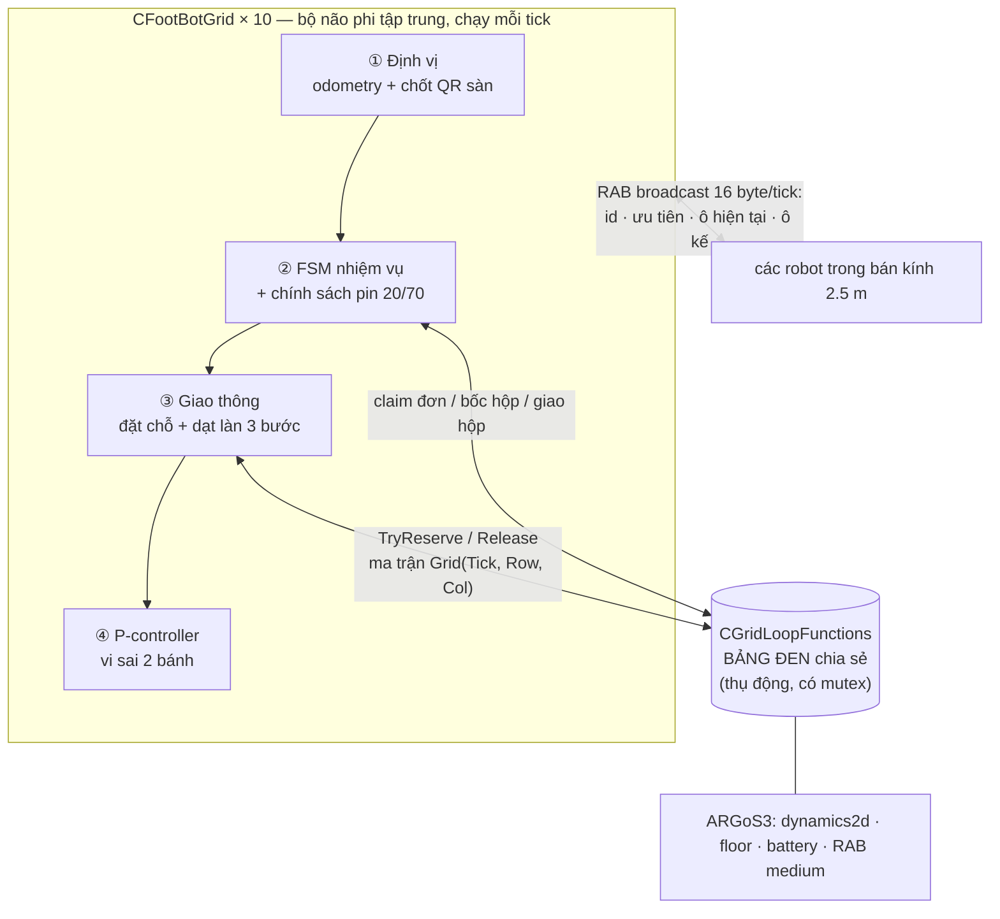
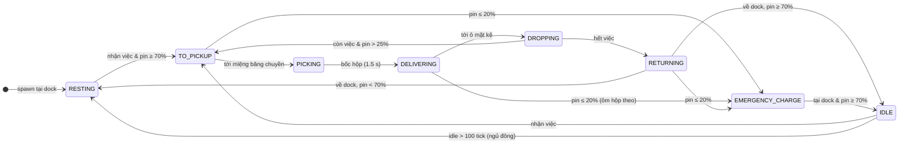

# 🤖 Grid Swarm Robot

**Mô phỏng hệ thống Swarm AMR phân loại hàng theo màu trên lưới rời rạc — điều phối phi tập trung, ARGoS3 / C++17**

`ARGoS 3` · `C++17` · `10 × foot-bot` · `lưới 30×30 @ 0.2 m` · `MAPF đặt chỗ không-thời gian` · `0 va chạm thực`

Hệ thống mô phỏng nhà kho thông minh theo mô hình Amazon Kiva / Geek+: 10 robot vi sai tự định vị bằng "camera gầm đọc mã QR sàn", tự nhận đơn, tự đặt chỗ ô lưới theo từng tick và tự đàm phán nhường đường qua sóng cục bộ — **không tồn tại máy chủ điều phối trung tâm**.

---

## 📋 Mục lục

1. [Tổng quan hệ thống](#1-tổng-quan-hệ-thống)
2. [Kiến trúc phần mềm](#2-kiến-trúc-phần-mềm)
3. [Bản đồ & hệ tọa độ](#3-bản-đồ--hệ-tọa-độ)
4. [Ngăn xếp thuật toán](#4-ngăn-xếp-thuật-toán)
5. [Máy trạng thái nhiệm vụ](#5-máy-trạng-thái-nhiệm-vụ)
6. [Mô hình năng lượng](#6-mô-hình-năng-lượng-hysteresis-20--70-)
7. [Kết quả thực nghiệm](#7-kết-quả-thực-nghiệm)
8. [Build & Chạy](#8-build--chạy)
9. [Cấu trúc mã nguồn](#9-cấu-trúc-mã-nguồn)
10. [Tham số tinh chỉnh](#10-tham-số-tinh-chỉnh)
11. [Giới hạn đã biết & hướng phát triển](#11-giới-hạn-đã-biết--hướng-phát-triển)

---

## 1. Tổng quan hệ thống

| Thành phần | Định lượng |
|---|---|
| Robot | 10 × foot-bot (vi sai, thân ⌀ 0.17 m) |
| Bản đồ | Lưới **30 × 30 ô**, mỗi ô **0.2 × 0.2 m** (vùng hữu ích 6 × 6 m) |
| Kích thước ô | ⌀ thân robot (0.17 m) + biên an toàn 0.03 m — *một ô chỉ vừa một robot* |
| Trạm sạc | 10 dock **ẩn danh** (ai đến trước dùng trước), 5 biên Tây + 5 biên Đông |
| Nguồn hàng | 3 băng chuyền, mỗi băng **trưng bày tối đa 3 hộp** (hàng đợi), màu ngẫu nhiên Đỏ/Lá/Dương |
| Điểm giao | 3 dãy kệ **vật cản vật lý cứng**, 60 ô kệ phát yêu cầu màu ngẫu nhiên |
| Vận tốc | V_Base = 10 cm/s (thẳng) · 3 cm/s (xoay 90° tại tâm ô) |
| Chu kỳ điều khiển | 10 tick/s (100 ms/tick) |

> 💡 **Vì sao bản đồ 30×30?** Phiên bản đầu dùng 50×50 (10×10 m) theo đặc tả gốc nhưng ~70 % diện tích là sàn trống — robot tốn phần lớn thời gian chạy rỗng. Bản đồ được *crop* còn 30×30 với **cùng số trạm, cùng toàn bộ thuật toán**: năng suất đo được tăng **+84 %** (59 so với 32 chuyến/20 phút) trong khi tổng quãng đường *giảm* 8 %.

---

## 2. Kiến trúc phần mềm

Ba tầng tách bạch: **robot tự trị** (trái) — **bảng đen thụ động** (phải) — engine vật lý (dưới). Bảng đen chỉ *ghi nhận và trả lời*, không bao giờ ra lệnh.



**Bản tin RAB 16 byte** (phát quảng bá mỗi tick, bán kính 2.5 m):

| Byte | 0 | 1 | 2 | 3–4 | 5–6 | 7 | 8 |
|---|---|---|---|---|---|---|---|
| Nội dung | ID | Ưu tiên (1/2/3) | Trạng thái FSM | Ô hiện tại (R,C) | Ô sắp vào (R,C) | Cờ chở hàng / nhường | % pin |

---

## 3. Bản đồ & hệ tọa độ

### 3.1 Sơ đồ mặt bằng (30 × 30 ô = 6 × 6 m)

```text
 Row                                                          x [m]
  ↑   ┌──────────────────────────────────────────────┐
 29   │ · · · · · · · đệm tường Bắc · · · · · · · ·  │  +2.9
 26   │ · · · ██████████ KỆ 3 ██████████ · · · · ·   │  +2.3
23-25 │ · · ·      ═══ hành lang đôi ═══        · ·  │
 22   │ · · · ██████████ KỆ 2 ██████████ · · · · ·   │  +1.5
19-21 │ · · ·      ═══ hành lang đôi ═══        · ·  │
 18   │ · · · ██████████ KỆ 1 ██████████ · · · · ·   │  +0.7
15-17 │ · · · · ·  vùng tiếp cận mặt kệ  · · · · ·   │
      │                                              │
10-14 │ ▓▓ DOCK TÂY (5)          (5) DOCK ĐÔNG ▓▓    │  −0.9…−0.1
      │                                              │
 3-9  │ · · · · ·  sàn lưu thông tự do  · · · · · ·  │
  2   │ · · ·  C₁ · · · · C₂ · · · · C₃  · · · · ·   │  −2.5
 0-1  │ · · · · · · · đệm tường Nam · · · · · · · ·  │  −2.9
      └──────────────────────────────────────────────┘
        Col: 0        7       15       23        29
        y:  −2.9    −1.5     +0.1     +1.7     +2.9   →
```

| Khu vực | Ô lưới | Tọa độ thế giới | Loại ô |
|---|---|---|---|
| Kệ hàng 1 / 2 / 3 | Row 18 / 22 / 26 · Col 5–24 | x = +0.7 / +1.5 / +2.3 · y ∈ [−2, +2] | `CELL_OBSTACLE` (box vật lý `0.2×4.0×0.5`) |
| Dock Tây / Đông | Row 10–14 · Col 0 / 29 | x ∈ [−0.9, −0.1] · y = ∓2.9 | `CELL_DOCK` |
| Băng chuyền C₁ C₂ C₃ | Row 2 · Col 7 / 15 / 23 | x = −2.5 · y = −1.5 / +0.1 / +1.7 | `CELL_CONVEYOR` |
| Còn lại (~820 ô) | — | — | `CELL_FREE` |

- Hai kệ liền nhau cách nhau đúng **4 Row** → hành lang đôi 3 hàng trống cho hai robot đối đầu né nhau.
- Kệ là **vật cản kép**: `CELL_OBSTACLE` trong ma trận logic (A* cấm tuyệt đối) **và** `<box movable="false">` trong engine vật lý (chặn cứng nếu có sai số) — robot không thể đi xuyên kho hàng.
- Giao hàng qua **ô mặt kệ** (`StackFaceCell`): ô trống liền kề trước/sau dải kệ; robot chọn mặt gần hơn, `DeliverBox()` chấp nhận cả hai mặt.

### 3.2 Ánh xạ tọa độ liên tục ⇄ ma trận

```text
        THẾ GIỚI LIÊN TỤC  (x, y) ∈ [−3, +3)²          MA TRẬN RỜI RẠC
   ┌────────────────────────────────────────────┐    ┌──────────────────┐
   │  Row = (int)((x + 3.0) / 0.2)              │ →  │ (Row, Col)       │
   │  Col = (int)((y + 3.0) / 0.2)              │    │ ∈ [0, 29]²       │
   ├────────────────────────────────────────────┤    ├──────────────────┤
   │  x_tâm = −3.0 + (Row + 0.5) × 0.2          │ ←  │ hồng tâm ô       │
   │  y_tâm = −3.0 + (Col + 0.5) × 0.2          │    │ (nơi dán QR sàn) │
   └────────────────────────────────────────────┘    └──────────────────┘
```

⚠️ Quy ước **Row ↔ trục X, Col ↔ trục Y** (đảo so với row~y/col~x thường gặp) — lựa chọn tường minh để "dãy kệ" là các dải Row cố định trải dọc trục Y.

---

## 4. Ngăn xếp thuật toán

| Tầng | Thuật toán | Tần suất gọi | File |
|---|---|---|---|
| Tìm đường toàn cục | **A\*** 4 hướng + phạt rẽ 0.35 | Khi đổi đích / kẹt bệnh lý | `footbot_grid_nav.cpp` |
| Chống va chạm | **Đặt chỗ không-thời gian** `Grid[Tick][(R,C)]=ID` | Trước mỗi bước ô | `grid_loop_functions.cpp` |
| Giải xung đột cục bộ | **Ưu tiên bất đối xứng + dạt làn 3 bước** | Khi RAB phát hiện tranh chấp | `footbot_grid_traffic.cpp` |
| Định vị | **Dead-reckoning + chốt mốc QR** | Mỗi tick | `footbot_grid_nav.cpp` |
| Bám quỹ đạo | **P-controller** vi sai | Mỗi tick | `footbot_grid_nav.cpp` |
| Phân việc | **Greedy claim** (min tổng Manhattan) | Khi rảnh | `footbot_grid.cpp` |

### 4.1 A* có phạt rẽ

Heuristic Manhattan; chi phí bước `g' = g + 1 + (đổi hướng ? 0.35 : 0)` → chuộng đường thẳng theo làn, giảm số lần xoay tại chỗ. `CELL_OBSTACLE` bị cấm **vô điều kiện**; ô dock/băng chuyền chỉ đi vào được khi là đích của chính robot. A* **không** dùng để né robot khác — việc đó thuộc tầng dưới.

### 4.2 Đặt chỗ không-thời gian (Space–Time Reservation)

```cpp
std::map<UInt32 /*Tick*/, std::map<std::pair<SInt32,SInt32> /*(Row,Col)*/, UInt8 /*RobotID*/>>
```

Robot phải giành được **trọn cửa sổ tick** `[now, now+25]` của ô kế tiếp *trước khi* bánh xe lăn về phía nó (nguyên tắc *đặt-trước-đi-sau*, all-or-nothing). Ô đang đứng được gia hạn mỗi tick; ô vừa rời giữ thêm 4 tick "ân hạn" cho đuôi xe. Tick quá khứ được dọn rác mỗi `PostStep` → bộ nhớ O(số ô đang giữ), chạy được vô hạn.

### 4.3 Ưu tiên bất đối xứng + dạt làn cục bộ 3 bước

Khi hai robot tranh chấp một ô (phát hiện qua RAB), quyền đi trước xác định **tất định ở cả hai phía, không cần bắt tay**:

```text
  Ưu tiên 1  >  Ưu tiên 2  >  Ưu tiên 3        hòa cấp → ID nhỏ thắng
  EMERGENCY     DELIVERING     còn lại
  (pin ≤ 20%)   (đang chở hộp) (chạy rỗng / về dock)
```

Robot **thắng**: giữ nguyên làn, giữ nguyên V_Base = 10 cm/s — không bẻ lái, không giảm tốc.
Robot **thua**: thực hiện **dạt làn đúng 3 bước** — *không bao giờ* gọi lại A* toàn cục để vòng xa:

```text
              bước ①            bước ②             bước ③
           rẽ vuông góc     tịnh tiến 1 ô       rẽ về làn cũ

làn phụ   ·   ·   ┌─────□─────────────□─────┐   ·   ·
                  │ ①                  ②    │
làn gốc   ──►  A ─┘      ◄── B ◄──          └──►□──► tiếp tục
               (thua quyền)  (thắng: đi thẳng   ③    lộ trình gốc
                              hết tốc, không né)
```

Cả 3 ô của lộ trình phụ được đặt chỗ **ngay khi bắt đầu** (giảm rủi ro robot thứ ba chen giữa). Nếu **cả hai** phía đều nghẽn → `TRAFFIC_YIELDING`: đứng im 1–2 tick rồi thử lại. Lưới an toàn cuối cho kẹt bệnh lý (hiếm): sau 3 s A* né các ô bị đặt chỗ, sau 8 s né luôn vị trí mọi hàng xóm RAB.

### 4.4 Định vị "camera gầm đọc QR sàn"

```text
   odometry encoder (trôi dần)          chốt QR (drift → 0)
  ───────────────────────────►  ●  ───────────────────────────►  ●
   ds  = (dL+dR)/2                 khi: cảm biến sàn thấy đĩa đen
   dθ  = (dR−dL)/L                  &  ước lượng cách tâm ô ≤ 0.02 m
   tích phân trung điểm             →  GHI ĐÈ (x, y, θ) tuyệt đối
```

> 🔬 **Phát hiện thực nghiệm:** foot-bot ARGoS có đúng **8 cảm biến sàn cố định trên vòng bán kính ~0.08 m** quanh tâm thân (hằng số phần cứng). Đĩa QR vẽ đúng 0.02 m sẽ lọt *hoàn toàn bên trong* vòng cảm biến → **0 lần phát hiện** dù robot đi chính xác qua tâm ô. Giải pháp: tách 2 khái niệm — đĩa vật lý **0.085 m** (đủ lớn để phần cứng thấy) và **ngưỡng tin cậy 0.02 m** (`qr_snap_radius`, điều kiện phần mềm trước khi ghi đè). Kết quả: ~3 900 lần chốt/20 phút, **0** lần lạc làn.

> 🎨 Đĩa QR **được ẩn khỏi màn hình** (nhìn đỡ rối mắt): cảm biến sàn đọc trực tiếp `GetFloorColor()` — tách biệt hoàn toàn với lớp vẽ 3D `DrawInWorld()`, nên một lớp phủ cùng màu nền che đĩa đen về mặt thị giác mà định vị không suy suyển.

### 4.5 P-controller bám tâm ô (vi sai 2 bánh)

```text
  err = wrap(atan2(Δy, Δx) − θ)
  |err| > 55°  →  xoay tại chỗ, bánh ±3 cm/s   (rẽ 90° đúng hồng tâm, chống trượt)
  |err| ≤ 55°  →  v = 10·cos(err) cm/s,  ω = 3.5·err
                  v_L = v − ωL/2,  v_R = v + ωL/2
  ô đích cuối  →  phanh tỷ lệ theo khoảng cách, dừng trong bán kính 0.02 m
```

---

## 5. Máy trạng thái nhiệm vụ



- **Mọi** trạng thái di chuyển đều có cạnh sang `EMERGENCY_CHARGE` khi pin ≤ 20 % (sơ đồ chỉ vẽ 3 cạnh tiêu biểu cho gọn).
- Khẩn cấp khi *chưa* bốc hộp → trả cả hộp lẫn yêu cầu về bảng đen cho robot khác; khi *đã* ôm hộp → giữ quyền giao, sạc xong đi giao nốt chính hộp đó.
- `RESTING` = ngủ đông tiết kiệm năng lượng (quét bảng việc thưa 2×), vẫn sạc thụ động.

---

## 6. Mô hình năng lượng (hysteresis 20 % / 70 %)

```text
 pin %
 100 ┤ ██                                                    ██
     │   ██   xả 0.8 đơn vị/tick khi lăn bánh             ██
  70 ┤─ ─ ─██─ ─ ─ ─ ─ ─ ─ ─ ─ ─ ─ ─ ─ ─ ─ ─ ─ ─ ─ ─ ██ ─ ─ ─  ← chỉ RỜI DOCK khi ≥ 70%
     │        ██                                    ██
     │          ██                 nạp 2.0/tick   ██
  20 ┤─ ─ ─ ─ ─ ─ ██ ─ ─ ─ ─ ─ ─ ┐ khi đứng yên ██─ ─ ─ ─ ─ ─  ← KHẨN CẤP: bỏ việc, ưu tiên 1
     │              ████████████ ▼ trong dock ██
   0 └──────────────────────────────────────────────────────► t
       làm việc ~16.7 phút liên tục      sạc 20→70% ≈ 4.2 phút
```

| Tham số | Giá trị | Ý nghĩa |
|---|---|---|
| `full_charge` | 10 000 đơn vị | Dung lượng tuyệt đối (thuộc tính `full_charge` của ARGoS) |
| `discharging_factor` | 0.05 → 0.8 đơn vị/tick | Xả **chỉ khi thực sự lăn bánh** ngoài dock |
| `charging_factor` | 2.0 → 2.0 đơn vị/tick | Nạp khi **đứng yên trong ô dock** (v ≈ 0) — dock ẩn danh |
| 100 % → 20 % | ≈ 10 000 tick = **16.7 phút** di chuyển liên tục | Nằm trong khoảng 15–20 phút yêu cầu |
| 20 % → 70 % | ≈ 2 500 tick = **4.2 phút** | |

> ⚙️ Model `time_motion` cài sẵn của bản ARGoS này dính lỗi NaN trong `ToAngleAxis` khi robot xoay → phần xả được tính **cùng công thức tuyến tính** tại loop functions; entity pin vẫn là kho lưu và cảm biến `battery` đọc bình thường (`discharge_model="time" delta="0"`).

---

## 7. Kết quả thực nghiệm

Điều kiện: seed 42 · 12 000 tick = **20 phút mô phỏng** · headless (~7 000 tick/s thực → chạy hết trong ~2 s).

| Chỉ số | Bản đồ 50×50 (cũ) | **Bản đồ 30×30 (crop)** | Nhận xét |
|---|---:|---:|---|
| Chuyến giao thành công | 32 | **59** | **+84 %** năng suất |
| — theo màu (Đ/L/D) | 12/13/7 | 28/13/18 | |
| Tổng quãng đường đội xe | 860 m | **794 m** | Ít chạy rỗng hơn |
| Khẩn cấp pin (đều tự hồi phục) | 10 | 6 | Chuyến ngắn → ít cạn giữa đường |
| Dạt làn cục bộ 3 bước | 29 | 47 | Mật độ cao → đàm phán nhiều hơn |
| Chốt QR (xóa drift) | ~4 300 | ~3 940 | ≈ 5 lần/m di chuyển |
| Lạc làn phải cứu hộ | 0 | **0** | Định vị kín 100 % |
| Chạm biên thân (< 0.17 m) | 17 | 32 | Toàn bộ ở 0.169–0.170 m, xem §11 |
| Hàng đợi băng chuyền | 9/9 hộp gần như thường trực | 9/9 | Nguồn hàng không nghẽn |

Tự tái lập:

```bash
sed -e 's|length="0"|length="1200"|' -e '/<visualization>/,/<\/visualization>/d' \
    experiments/grid_swarm.argos > /tmp/gs.argos
argos3 -c /tmp/gs.argos 2>&1 | grep -E "Delivered total|Emergencies|VA CHAM|dat lan"
```

---

## 8. Build & Chạy

```bash
# 1. Mở container ARGoS (host)
cd /home/dvt/argos && ./run.sh

# 2. Build (trong container, lần đầu)
cd ~/workspace/grid-swarm-robot
mkdir -p build && cd build
cmake .. -DCMAKE_BUILD_TYPE=Release && make -j$(nproc)

# 3. Chạy GUI (từ thư mục gốc project — .argos dùng đường dẫn tương đối)
cd ~/workspace/grid-swarm-robot
argos3 -c experiments/grid_swarm.argos     # mở ở trạng thái tạm dừng → bấm ▶
```

**Chú giải hình ảnh GUI:**

| Hình ảnh | Ý nghĩa |
|---|---|
| Sàn trắng + lưới kẻ mảnh | Đĩa QR bị che thị giác (định vị vẫn chạy ngầm, §4.4) |
| 2 dải nền xanh nhạt hai biên | 10 ô dock sạc |
| 3 ô nền xám ở đáy + tháp hộp ≤ 3 tầng | Băng chuyền + hàng đợi hộp đang trưng bày |
| 3 khối tường dài phía trên | Dãy kệ — vật cản vật lý thật |
| Khối màu lơ lửng cạnh kệ | Ô mặt kệ đang yêu cầu hộp màu đó |
| Nhãn `fb3 87% DELIVERING *` | ID · %pin · trạng thái · `*` = đang dạt làn |
| LED cam / tím | Đậu dock (IDLE/RESTING) / khẩn cấp pin |

---

## 9. Cấu trúc mã nguồn

```text
grid-swarm-robot/
├── grid_layout.h                    ← NGUỒN CHÂN LÝ hình học: kích thước lưới,
│                                       công thức ánh xạ, vị trí trạm, giao thức RAB
├── controllers/footbot_grid/
│   ├── footbot_grid.h               ← khai báo controller + FSM + tham số
│   ├── footbot_grid.cpp             ← vòng đời ControlStep, FSM, claim việc, pin
│   ├── footbot_grid_nav.cpp         ← định vị QR, A*, P-controller
│   └── footbot_grid_traffic.cpp     ← đặt chỗ, ưu tiên, dạt làn 3 bước
├── loop_functions/grid_loop_functions/
│   ├── grid_loop_functions.{h,cpp}  ← bảng đen: reservation theo tick, bảng việc,
│   │                                   pin định lượng, an toàn, thống kê
│   ├── grid_floor_render.cpp        ← GetFloorColor() — nguồn dữ liệu cảm biến sàn
│   └── grid_qt_user_functions.{h,cpp} ← DrawInWorld() (≈ PostDraw): lớp che QR,
│                                         lưới 3D, hộp hàng, nhãn robot
└── experiments/grid_swarm.argos     ← kịch bản: arena, vật cản, 10 robot, camera
```

> 🔗 Controller gọi trực tiếp API bảng đen (phụ thuộc 2 chiều) → cả hai biên dịch chung **một** `libgrid_loop_functions.so` (bộ nạp động của ARGoS không phân giải được typeinfo chéo giữa 2 thư viện nạp tuần tự).

---

## 10. Tham số tinh chỉnh

Tất cả nằm trong `experiments/grid_swarm.argos`:

| Nhóm | Tham số | Mặc định | Tác dụng |
|---|---|---|---|
| Chuyển động | `cruise_speed_cms` / `pivot_speed_cms` | 10 / 3 | V_Base thẳng / xoay 90° |
| Chuyển động | `hard_turn_deg` | 55° | Ngưỡng chuyển sang xoay tại chỗ |
| Định vị | `qr_snap_radius` | 0.02 m | Ngưỡng tin cậy trước khi chốt QR |
| Năng lượng | `low_threshold` / `leave_threshold` | 0.20 / 0.70 | Hai ngưỡng hysteresis |
| Năng lượng | `discharging_factor` / `charging_factor` | 0.05 / 2.0 | Tốc độ xả / nạp |
| Nguồn hàng | `box_respawn_min/max` | 20 / 80 tick | Nhịp sinh hộp khi băng chuyền còn chỗ (< 3) |
| Đơn hàng | `max_active_demands` / `demand_period` | 12 / 30 tick | Số yêu cầu màu mở đồng thời |
| Hành vi | `idle_rest_ticks` | 100 | Idle bao lâu thì ngủ đông |

Đổi **hình học** kho (kích thước lưới, vị trí trạm): sửa `grid_layout.h` **và** đồng bộ tay vị trí box vật cản + spawn robot + tường trong `.argos` (hai file phải khớp nhau, không có kiểm tra chéo lúc chạy).

---

## 11. Giới hạn đã biết & hướng phát triển

**Chạm biên thân 0.169–0.170 m.** Ô 0.2 m = thân 0.17 m + biên 3 cm theo đặc tả — hai robot ở hai làn kề (tâm cách đúng 0.2 m) chỉ dư 3 cm. Trong 20 phút ghi nhận 32 sự kiện khoảng cách < 0.17 m, **toàn bộ nằm ở 0.1689–0.170 m** (lún ≤ 1 mm): đây là chạm biên hình học do dung sai chuyển động liên tục (quán tính + làm tròn tick của dynamics2d), *không phải* lỗi logic — bảng đặt chỗ chưa từng cấp một ô cho hai robot. Muốn biên tuyệt đối: tăng `CELL_SIZE` lên 0.22–0.25 m (và đồng bộ `.argos`).

**Hướng phát triển:**
- [ ] Windowed-A* đầy đủ trên chiều thời gian (thay A* tĩnh + đặt chỗ tách rời)
- [ ] Nhiễu encoder/cảm biến cấu hình được để stress-test bộ chốt QR
- [ ] Đấu giá đơn hàng qua RAB (thay greedy-claim trên bảng đen)
- [ ] Xuất metrics CSV theo tick phục vụ vẽ đồ thị so sánh chính sách
